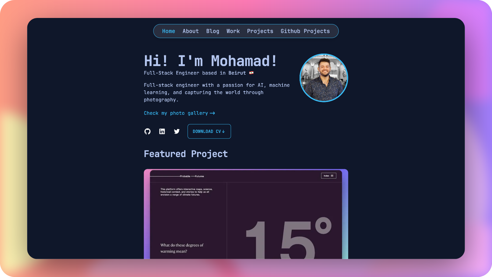

# Mohamad Omran Portfolio

[](https://mohamadomran.dev/)

## Getting this project up and running

1.  Fork or clone this project from Github to get your own copy of it.
2.  Navigate into your new site’s directory and start it up.

    ```sh
    cd portfolio/
    yarn install
    ```

    then

    ```sh
    yarn dev
    ```

3.  Your site is now running at `http://localhost:3000`!
    Open the `portfolio` directory in your code editor of choice and edit `src/pages/index.tsx`. Save your changes and the browser will update in real time!

4.  Create a `.env.local` file using `.env.example` as a template.
